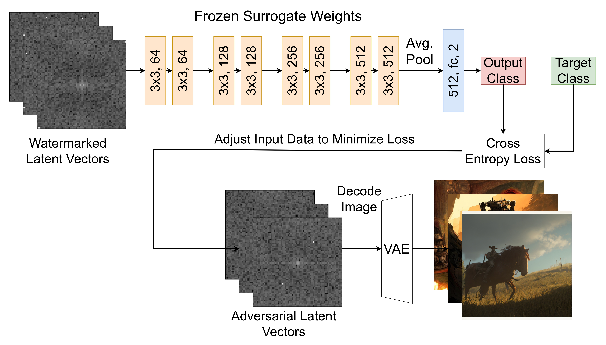

# A Crack in the Bark: Leveraging Public Knowledge to Remove Tree-Ring Watermarks

This code is the official implementation for A Crack in the Bark.

<p align="center" >
    
</p>

## Dependencies
```
pytorch==1.13.0
torchvision==0.14.0
transformers==4.42.4 
diffusers==0.21.1 
numpy==1.26.3 
datasets 
ftfy 
matplotlib 
accelerate==0.32.1 
scikit-image 
scikit-learn
huggingface_hub==0.28.0
```
The most importand dependencies are `diffusers` and `transformers`. Specifically those versions are used as loading additional models may not work with newer versions.

Additionally the docker file is provided to allow you to build an environment to reliably run our experiments.

## Setup
Included in this repository there are two zip files, `wmvspub_imagenet.tar.gz` and `wmvsunwm_imagenet.tar.gz`. These are used as both the reference images and public dataset for training the surrogate models used in our attacks.

Additionally, you'll need the [`512x512_diffusion.pt`](https://openaipublic.blob.core.windows.net/diffusion/jul-2021/512x512_diffusion.pt) model weights from OpenAI's [guided diffusion](https://github.com/openai/guided-diffusion).

For calculating LPIPS you'll need the Alexnet weights from the [LPIPS repository](https://github.com/richzhang/PerceptualSimilarity/tree/master). The `weights` directory under the `lpips` directory need to be placed at the base of this repository. 

# Usage
Our experiments generally follow 4 stages, image generation, surrogate training, watermark removal and assessing the images. Example commands used to execute our experiments can be found in [`example_pipelines.md`](./example_pipelines.md), main changed the user has to make is providing the required paths to specific data directories and parameters for the attacks.

## Generation
The image generation script, `generate_data.py`, attaches a customized Logger object to save the outputs and additional meta data required for our experiments. After finishing a new folder will be created following this structure:
```
logs
  |- run-[YYYYMMDD_HHMMSS]-[run_name]-[Random String]
      |- media
      |   |- wm_img
      |   |- no_wm_img
      |   |- table
      |   |- wm_raw_latent
      |   |- no_wm_raw_latent
      |- config.yml
      |- summary.json
      |- tr_params.pth
```
The `media` folder holds the data used in training our surrogates, including the images generated with Tree Ring watermarks and the non watermarked counterparts to train a surrogate for the `wmvsunwm` experiments. Optionally, you may save the true latents just before decoding via Stable Diffusions VAE and they will be stored within the `media` subdirectory. An example call signature:
```
python generate_data.py --run_name=experiement_name \
                        --dataset=./prompts/wmvs[unwm/pub]_prompts.csv \
                        --gen_with_wm \
                        --save_raw_latent \
                        --w_channel=3 \
```
Will generate Tree Ring watermarked images and their non watermarked counterparts based on the prompts given in `wmvsunwm_prompts.csv` or `wmvspub_prompts.csv`. The `--save_raw_latent` enables saving the true latents. Additionally you may edit the tree ring watermarking parameters, for example we chose to embed the watermark specifically into the fourth channel of the latent.

#### NOTE: The True Latents are stored in the [wm/no_wm]_raw_latent directories by default.

Under the `table` directory a `.csv` file will be created which links the watermarked/non-watemarked images with the prompt used to generate them.

To enable our attacks, we also need to recover the latents using VAE's we mention in our paper. Currently this repository only supports Stable Diffusion, SDXL and Ostris's VAEs. The script `recover_latents.py` will do exactly that. Unlike `generate_data.py`, this will not attach a Logger object thus you must specify the output directory and filename directly. We recommend placing them under the `media` directory where the watermarked/non watermarked images used to recover the latents are stored to keep the data all in one place.
```
python recover_latents.py ./path/to/generated/images/ \
                          ./path/to/output/latents/ \
                          latents_filename \
                          --model_id=stabilityai/sdxl-vae \
```
Which will recover the latents of the generated images using SDXL's VAE.

## Surrogate Training
The surrogate training script, `train_surrogate.py`, will not attach a Logger object thus you must specify the model's output directory and filename explicitly. An example call signature:
```
python train_surrogate.py ./path/to/wm_images/ \
                          ./path/to/non_wm_images/ \
                          ./model/output/ \
                          model_name \
                          --mode='latent' \
                          --vae='stabilityai/sdxl-vae' \
                          --apply_fft \
                          --batch_size=8 \
                          --epochs=20 \
                          --v
```
Which trains a surrogate model using the recovered latent vectors from with SDXL's VAE, applying FFT on the data and additional experiment parameters. The `--v` flag enables the printing of the training results.

## Watermark Removal
The watermark removal script, `remove_watermark.py`, will not attach a Logger object thus requires explicit definition of the output path. This script implements the replication of the adversarial noising attack and our attacks. An example call signature:
```
python remove_watermark.py ./path/to/wm_images/ \
                           ./output/path/to/attacked_images/ \
                           --surrogate_save_path=./path/to/trained/surrogate.pth \
                           --attack=surrogate_pgd \
                           --mode=latent \
                           --batch_size=8 \
                           --strength=32 \
                           --vae=stabilityai/sdxl-vae \
                           --apply_fft
```
Which instantiates our VAE enabled PGD attack using the surrogate trained in the previous section and provided in the `surrogate_save_path`. The `--strength` parameter is $\delta$ specified in our paper and controls the strength of the perturbations. The `--vae` parameter specifies the VAE to use to project back to latent space before applying PGD.

## Assessing Images
Finally the image assessment script, `assess_images.py`, will calculate the performance metrics and quality measures we report in our paper. This script will attach a Logger object meaning that another experiment directory will be created under `logs`.
```
logs
  |- run-[YYYYMMDD_HHMMSS]-[run_name]-[Random String]
      |- media
      |   |- table
      |       |- PRC_Table.csv
      |- config.yml
      |- summary.json
```
It has a similar structure to the logs from `generate_data.py` however, `summary.json` holds the final aggregated scores for the performance and quality metrics. An example call signature:
```
python assess_images.py --run_name=experiment_name \
                        --original_images_path=./path/to/wm_imgs/ \
                        --adv_images_path=./path/to/attacked_images/ \
                        --table_path=./path/to/table/metadata.csv \
                        --imagenet_path=./wmvsunwm_imagenet/ \
                        --watermark_path=./path/to/tr_params.pth \
                        --reference_model=ViT-g-14 \
                        --reference_model_pretrain=laion2b_s12b_b42k
```
Note that `--table_path` is the metadata `.csv` created when generating the `wm_imgs` as the linkage of the image to the prompts is important when calculating the CLIP score. `--imagenet_path` is the path to the unzipped `wmvs[unwm/pub]_imagenet.tar.gz` archive.

## Acknowledgements
This repository borrows parts from the following:

Credit to Sébastien M. Popoff for implementation of complex modules in pytorch, the full repository is cloned into this repository since the pip wheel version is outdated and has bugs:

[](https://doi.org/10.1103/PhysRevX.11.021060)

Credit to Ilharco et al. for the implementation of OpenCLIP, the code for calculating the CLIP score comes from their repository:

[](https://zenodo.org/badge/latestdoi/390536799)

Credit to Wen et al. for the original tree ring implementation, the code for generating the tree ring parameters was adapted their repository:

https://github.com/YuxinWenRick/tree-ring-watermark

Credit to Zhang et al. for the implementation of LPIPS calculation, the code and model weights was borrowed from:

https://github.com/richzhang/PerceptualSimilarity/tree/master