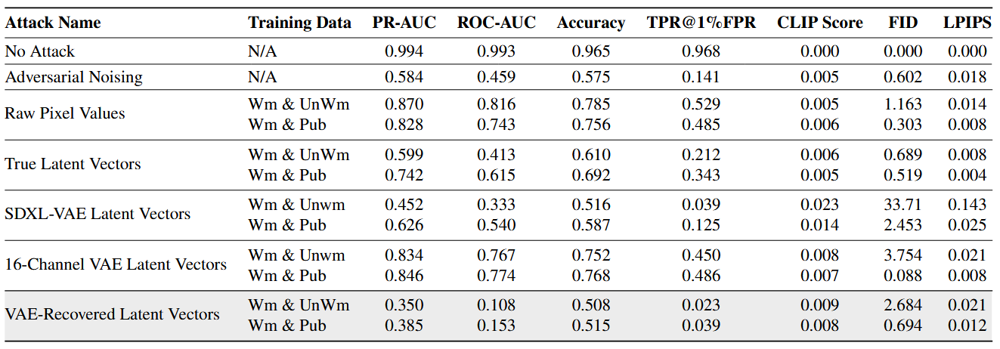

# Example script pipelines
This document exists to aid users in recreating the results reported in our paper. Specifically those reported in Table 2:

<p align="center">
    
</p>

Assuming you have followed the steps in the setup section of the README, you can follow the python command pipelines below to execute the full attack process including generation, training, removal and assessment.

Each attack may require the user to substitute parameter's with values specific to their environment. You will need to replace the `[datetime]` and `[random string]` strings below with the log output generated in your own runs.

After the `assess_images.py` script is finished running, a new log directory is added. The final accumulated scores are stored in a json file called summary, e.g. in `./logs/run-[datetime]-adv_noising-[random_string]/summary.json`.

Additionally note that the data generated for each experiment may overlap so you can reuse the data generated in one experiment in another.

## No Attack
```
python generate_data.py --run_name=stable_diffusion_data \
                        --dataset=./prompts/wmvsunwm_prompts.csv \
                        --gen_with_wm \
                        --w_pattern=ring \
                        --w_channel=3

python assess_images.py --run_name=no_attack \
                        --original_images_path=./logs/run-[datetime]-stable_diffusion_data-[random string]/media/wm_img/ \
                        --adv_images_path=./logs/run-[datetime]-stable_diffusion_data-[random string]/media/wm_img/ \
                        --table_path=./logs/run-[datetime]-stable_diffusion_data-[random string]/media/table/metadata.csv \
                        --imagenet_path=./wmvsunwm_imagenet/ \
                        --watermark_path=./logs/run-[datetime]-stable_diffusion_data-[random string]/tr_params.pth \
                        --reference_model=ViT-g-14 \
                        --reference_model_pretrain=laion2b_s12b_b42k
```

## Adversarial Noising
```
python generate_data.py --run_name=stable_diffusion_data \
                        --dataset=./prompts/wmvsunwm_prompts.csv \
                        --gen_with_wm \
                        --w_pattern=ring \
                        --w_channel=3

python remove_watermark.py ./logs/run-[datetime]-stable_diffusion_data-[random string]/media/wm_img/ \
                           ./output/images/adv_noising/ \
                           --attack=adv_noising \
                           --mode=rawpix \
                           --batch_size=1 \
                           --n_steps=5 \
                           --vae=CompVis/stable-diffusion-v1-1 \
                           --inference_steps=20 \
                           --w_params_path=./logs/run-[datetime]-stable_diffusion_data-[random string]/tr_params.pth

python assess_images.py --run_name=adv_noising \
                        --original_images_path=./logs/run-[datetime]-stable_diffusion_data-[random string]/media/wm_img/ \
                        --adv_images_path=./output/images/adv_noising/ \
                        --table_path=./logs/run-[datetime]-stable_diffusion_data-[random string]/media/table/metadata.csv \
                        --imagenet_path=./wmvsunwm_imagenet/ \
                        --watermark_path=./logs/run-[datetime]-stable_diffusion_data-[random string]/tr_params.pth \
                        --reference_model=ViT-g-14 \
                        --reference_model_pretrain=laion2b_s12b_b42k
```

## Raw Pixel Values
#### Wm vs UnWm
```
python generate_data.py --run_name=stable_diffusion_data_wmvsunwm \
                        --dataset=./prompts/wmvsunwm_prompts.csv \
                        --gen_with_wm \
                        --w_pattern=ring \
                        --w_channel=3

python train_surrogate.py ./logs/run-[datetime]-stable_diffusion_data_wmvsunwm-[random_string]/media/wm_img/ \
                          ./logs/run-[datetime]-stable_diffusion_data_wmvsunwm-[random_string]/media/no_wm_img/ \
                          ./output/models/ \
                          wmvsunwm_rawpix \
                          --mode=rawpix \
                          --vae=none \
                          --batch_size=16 \
                          --epochs=20 \
                          --v

python remove_watermark.py ./logs/run-[datetime]-stable_diffusion_data_wmvsunwm-[random_string]/media/wm_img/ \
                           ./output/images/wmvsunwm_rawpix/ \
                           --model_save_path=./output/models/wmvsunwm_rawpix.pth \
                           --batch_size=8 \
                           --strength=32 \
                           --vae=none

python assess_images.py --run_name=wmvsunwm_rawpix \
                        --original_images_path=./logs/run-[datetime]-stable_diffusion_data_wmvsunwm-[random string]/media/wm_img/ \
                        --adv_images_path=./output/images/wmvsunwm_rawpix/ \
                        --table_path=./logs/run-[datetime]-stable_diffusion_data_wmvsunwm-[random string]/media/table/metadata.csv \
                        --imagenet_path=./wmvsunwm_imagenet/ \
                        --watermark_path=./logs/run-[datetime]-stable_diffusion_data_wmvsunwm-[random string]/tr_params.pth \
                        --reference_model=ViT-g-14 \
                        --reference_model_pretrain=laion2b_s12b_b42k
```
#### Wm vs Public
```
python generate_data.py --run_name=stable_diffusion_data_wmvspub \
                        --dataset=./prompts/wmvspub_prompts.csv \
                        --gen_with_wm \
                        --w_pattern=ring \
                        --w_channel=3

python train_surrogate.py ./logs/run-[datetime]-stable_diffusion_data_wmvspub-[random_string]/media/wm_img/ \
                          ./wmvspub_imagenet/ \
                          ./output/models/ \
                          wmvspub_rawpix \
                          --mode=rawpix \
                          --vae=none \
                          --batch_size=16 \
                          --epochs=20 \
                          --v

python remove_watermark.py ./logs/run-[datetime]-stable_diffusion_data_wmvspub-[random_string]/media/wm_img/ \
                           ./output/images/wmvspub_rawpix/ \
                           --model_save_path=./output/models/wmvspub_rawpix.pth \
                           --batch_size=8 \
                           --strength=32 \
                           --vae=none

python assess_images.py --run_name=wmvspub_rawpix \
                        --original_images_path=./logs/run-[datetime]-stable_diffusion_data_wmvspub-[random string]/media/wm_img/ \
                        --adv_images_path=./output/images/wmvspub_rawpix/ \
                        --table_path=./logs/run-[datetime]-stable_diffusion_data_wmvspub-[random string]/media/table/metadata.csv \
                        --imagenet_path=./wmvspub_imagenet/ \
                        --watermark_path=./logs/run-[datetime]-stable_diffusion_data_wmvspub-[random string]/tr_params.pth \
                        --reference_model=ViT-g-14 \
                        --reference_model_pretrain=laion2b_s12b_b42k
```

## True Latent Vectors
#### Wm vs UnWm
```
python generate_data.py --run_name=stable_diffusion_data_wmvsunwm \
                        --dataset=./prompts/wmvsunwm_prompts.csv \
                        --gen_with_wm \
                        --save_raw_latent \
                        --w_pattern=ring \
                        --w_channel=3

python train_surrogate.py ./logs/run-[datetime]-stable_diffusion_data_wmvsunwm-[random string]/media/wm_raw_latent/data.pt \
                       ./logs/run-[datetime]-stable_diffusion_data_wmvsunwm-[random string]/media/no_wm_raw_latent/data.pt \
                       ./output/models/ \
                       wmvsunwm_true_latent \
                       --mode=t49latent \
                       --apply_fft \
                       --batch_size=16 \
                       --epochs=20 \
                       --v

python remove_watermark.py ./logs/run-[datetime]-stable_diffusion_data_wmvsunwm-[random string]/media/wm_raw_latent/data.pt \
                           ./output/images/wmvsunwm_true_latent/ \
                           --model_save_path=./output/models/wmvsunwm_true_latent.pth \
                           --mode=t49latent \
                           --batch_size=8 \
                           --strength=32 \
                           --vae=stabilityai/stable-diffusion-2-1-base \
                           --apply_fft

python assess_images.py --run_name=wmvsunwm_true_latent \
                        --original_images_path=./logs/run-[datetime]-stable_diffusion_data_wmvsunwm-[random string]/media/wm_img/ \
                        --adv_images_path=./output/images/wmvsunwm_true_latent/ \
                        --table_path=./logs/run-[datetime]-stable_diffusion_data_wmvsunwm-[random string]/media/table/metadata.csv \
                        --imagenet_path=./wmvsunwm_imagenet/ \
                        --watermark_path=./logs/run-[datetime]-stable_diffusion_data_wmvsunwm-[random string]/tr_params.pth \
                        --reference_model=ViT-g-14 \
                        --reference_model_pretrain=laion2b_s12b_b42k
```
#### Wm vs Public
```
python generate_data.py --run_name=stable_diffusion_data_wmvspub \
                        --dataset=./prompts/wmvspub_prompts.csv \
                        --gen_with_wm \
                        --save_raw_latent \
                        --w_pattern=ring \
                        --w_channel=3

python recover_latents.py ./wmvspub_imagenet/ \
                          ./logs/run-[datetime]-stable_diffusion_data_wmvspub-[random string]/media/pub_raw_latent/ \
                          data

python train_surrogate.py ./logs/run-[datetime]-stable_diffusion_data_wmvspub-[random string]/media/wm_raw_latent/data.pt \
                       ./logs/run-[datetime]-stable_diffusion_data_wmvspub-[random string]/media/pub_raw_latent/data.pt \
                       ./output/models/ \
                       wmvspub_true_latent \
                       --mode=t49latent \
                       --apply_fft \
                       --batch_size=16 \
                       --epochs=20 \
                       --v

python remove_watermark.py ./logs/run-[datetime]-stable_diffusion_data_wmvspub-[random string]/media/wm_raw_latent/data.pt \
                           ./output/images/wmvspub_true_latent/ \
                           --model_save_path=./output/models/wmvspub_true_latent.pth \
                           --mode=t49latent \
                           --batch_size=8 \
                           --strength=32 \
                           --vae=stabilityai/stable-diffusion-2-1-base \
                           --apply_fft

python assess_images.py --run_name=wmvspub_true_latent \
                        --original_images_path=./logs/run-[datetime]-stable_diffusion_data_wmvspub-[random string]/media/wm_img/ \
                        --adv_images_path=./output/images/wmvspub_true_latent/ \
                        --table_path=./logs/run-[datetime]-stable_diffusion_data_wmvspub-[random string]/media/table/metadata.csv \
                        --imagenet_path=./wmvspub_imagenet/ \
                        --watermark_path=./logs/run-[datetime]-stable_diffusion_data_wmvspub-[random string]/tr_params.pth \
                        --reference_model=ViT-g-14 \
                        --reference_model_pretrain=laion2b_s12b_b42k
```

## SDXL-VAE Latent Vectors
#### Wm vs UnWm
```
python generate_data.py --run_name=stable_diffusion_data_wmvsunwm \
                        --dataset=./prompts/wmvsunwm_prompts.csv \
                        --gen_with_wm \
                        --w_pattern=ring \
                        --w_channel=3

python recover_latents.py ./logs/run-[datetime]-stable_diffusion_data_wmvsunwm-[random string]/media/wm_img/ \
                          ./logs/run-[datetime]-stable_diffusion_data_wmvsunwm-[random string]/media/wm_sdxl_latent/ \
                          data \
                          --model_id=stabilityai/sdxl-vae

python recover_latents.py ./logs/run-[datetime]-stable_diffusion_data_wmvsunwm-[random string]/media/no_wm_img/ \
                          ./logs/run-[datetime]-stable_diffusion_data_wmvsunwm-[random string]/media/no_wm_sdxl_latent/ \
                          data \
                          --model_id=stabilityai/sdxl-vae

python train_surrogate.py ./logs/run-[datetime]-stable_diffusion_data_wmvsunwm-[random string]/media/wm_sdxl_latent/data.pt \
                       ./logs/run-[datetime]-stable_diffusion_data_wmvsunwm-[random string]/media/no_wm_sdxl_latent/data.pt \
                       ./output/models/ \
                       wmvsunwm_sdxl_latent \
                       --mode=latent \
                       --vae=stabilityai/sdxl-vae \
                       --apply_fft \
                       --batch_size=16 \
                       --epochs=20 \
                       --v

python remove_watermark.py ./logs/run-[datetime]-stable_diffusion_data_wmvsunwm-[random string]/media/wm_sdxl_latent/data.pt \
                           ./output/images/wmvsunwm_sdxl_latent/ \
                           --model_save_path=./output/models/wmvsunwm_sdxl_latent.pth \
                           --mode=latent \
                           --batch_size=8 \
                           --strength=32 \
                           --vae=stabilityai/sdxl-vae \
                           --apply_fft

python assess_images.py --run_name=wmvsunwm_sdxl_latent \
                        --original_images_path=./logs/run-[datetime]-stable_diffusion_data_wmvsunwm-[random string]/media/wm_img/ \
                        --adv_images_path=./output/images/wmvsunwm_sdxl_latent/ \
                        --table_path=./logs/run-[datetime]-stable_diffusion_data_wmvsunwm-[random string]/media/table/metadata.csv \
                        --imagenet_path=./wmvsunwm_imagenet/ \
                        --watermark_path=./logs/run-[datetime]-stable_diffusion_data_wmvsunwm-[random string]/tr_params.pth \
                        --reference_model=ViT-g-14 \
                        --reference_model_pretrain=laion2b_s12b_b42k
```
#### Wm vs Public
```
python generate_data.py --run_name=stable_diffusion_data_wmvspub \
                        --dataset=./prompts/wmvspub_prompts.csv \
                        --gen_with_wm \
                        --w_pattern=ring \
                        --w_channel=3

python recover_latents.py ./logs/run-[datetime]-stable_diffusion_data_wmvspub-[random string]/media/wm_img/ \
                          ./logs/run-[datetime]-stable_diffusion_data_wmvspub-[random string]/media/wm_sdxl_latent/ \
                          data \
                          --model_id=stabilityai/sdxl-vae

python recover_latents.py ./wmvspub_imagenet/ \
                          ./logs/run-[datetime]-stable_diffusion_data_wmvspub-[random string]/media/pub_sdxl_latent/ \
                          data \
                          --model_id=stabilityai/sdxl-vae

python train_surrogate.py ./logs/run-[datetime]-stable_diffusion_data_wmvspub-[random string]/media/wm_sdxl_latent/data.pt \
                       ./logs/run-[datetime]-stable_diffusion_data_wmvspub-[random string]/media/pub_sdxl_latent/data.pt \
                       ./output/models/ \
                       wmvspub_sdxl_latent \
                       --mode=latent \
                       --vae=stabilityai/sdxl-vae \
                       --apply_fft \
                       --batch_size=16 \
                       --epochs=20 \
                       --v

python remove_watermark.py ./logs/run-[datetime]-stable_diffusion_data_wmvspub-[random string]/media/wm_sdxl_latent/data.pt \
                           ./output/images/wmvspub_sdxl_latent/ \
                           --model_save_path=./output/models/wmvspub_sdxl_latent.pth \
                           --mode=latent \
                           --batch_size=8 \
                           --strength=32 \
                           --vae=stabilityai/sdxl-vae \
                           --apply_fft

python assess_images.py --run_name=wmvspub_sdxl_latent \
                        --original_images_path=./logs/run-[datetime]-stable_diffusion_data_wmvspub-[random string]/media/wm_img/ \
                        --adv_images_path=./output/images/wmvspub_sdxl_latent/ \
                        --table_path=./logs/run-[datetime]-stable_diffusion_data_wmvspub-[random string]/media/table/metadata.csv \
                        --imagenet_path=./wmvspub_imagenet/ \
                        --watermark_path=./logs/run-[datetime]-stable_diffusion_data_wmvspub-[random string]/tr_params.pth \
                        --reference_model=ViT-g-14 \
                        --reference_model_pretrain=laion2b_s12b_b42k
```
## 16-Channel VAE Latent Vectors
#### Wm vs UnWm
```
python generate_data.py --run_name=stable_diffusion_data_wmvsunwm \
                        --dataset=./prompts/wmvsunwm_prompts.csv \
                        --gen_with_wm \
                        --w_pattern=ring \
                        --w_channel=3

python recover_latents.py ./logs/run-[datetime]-stable_diffusion_data_wmvsunwm-[random string]/media/wm_img/ \
                          ./logs/run-[datetime]-stable_diffusion_data_wmvsunwm-[random string]/media/wm_ostris_latent/ \
                          data \
                          --model_id=ostris/vae-kl-f8-d16

python recover_latents.py ./logs/run-[datetime]-stable_diffusion_data_wmvsunwm-[random string]/media/no_wm_img/ \
                          ./logs/run-[datetime]-stable_diffusion_data_wmvsunwm-[random string]/media/no_wm_ostris_latent/ \
                          data \
                          --model_id=ostris/vae-kl-f8-d16

python train_surrogate.py ./logs/run-[datetime]-stable_diffusion_data_wmvsunwm-[random string]/media/wm_ostris_latent/data.pt \
                       ./logs/run-[datetime]-stable_diffusion_data_wmvsunwm-[random string]/media/no_wm_ostris_latent/data.pt \
                       ./output/models/ \
                       wmvsunwm_ostris_latent \
                       --mode=latent \
                       --vae=ostris/vae-kl-f8-d16 \
                       --apply_fft \
                       --batch_size=16 \
                       --epochs=20 \
                       --v

python remove_watermark.py ./logs/run-[datetime]-stable_diffusion_data_wmvsunwm-[random string]/media/wm_ostris_latent/data.pt \
                           ./output/images/wmvsunwm_ostris_latent/ \
                           --model_save_path=./output/models/wmvsunwm_ostris_latent.pth \
                           --mode=latent \
                           --batch_size=8 \
                           --strength=32 \
                           --vae=ostris/vae-kl-f8-d16 \
                           --apply_fft

python assess_images.py --run_name=wmvsunwm_ostris_latent \
                        --original_images_path=./logs/run-[datetime]-stable_diffusion_data_wmvsunwm-[random string]/media/wm_img/ \
                        --adv_images_path=./output/images/wmvsunwm_ostris_latent/ \
                        --table_path=./logs/run-[datetime]-stable_diffusion_data_wmvsunwm-[random string]/media/table/metadata.csv \
                        --imagenet_path=./wmvsunwm_imagenet/ \
                        --watermark_path=./logs/run-[datetime]-stable_diffusion_data_wmvsunwm-[random string]/tr_params.pth \
                        --reference_model=ViT-g-14 \
                        --reference_model_pretrain=laion2b_s12b_b42k
```
#### Wm vs Public
```
python generate_data.py --run_name=stable_diffusion_data_wmvspub \
                        --dataset=./prompts/wmvspub_prompts.csv \
                        --gen_with_wm \
                        --w_pattern=ring \
                        --w_channel=3

python recover_latents.py ./logs/run-[datetime]-stable_diffusion_data_wmvspub-[random string]/media/wm_img/ \
                          ./logs/run-[datetime]-stable_diffusion_data_wmvspub-[random string]/media/wm_ostris_latent/ \
                          data \
                          --model_id=ostris/vae-kl-f8-d16

python recover_latents.py ./wmvspub_imagenet/ \
                          ./logs/run-[datetime]-stable_diffusion_data_wmvspub-[random string]/media/pub_ostris_latent/ \
                          data \
                          --model_id=ostris/vae-kl-f8-d16

python train_surrogate.py ./logs/run-[datetime]-stable_diffusion_data_wmvspub-[random string]/media/wm_ostris_latent/data.pt \
                       ./logs/run-[datetime]-stable_diffusion_data_wmvspub-[random string]/media/pub_ostris_latent/data.pt \
                       ./output/models/ \
                       wmvspub_ostris_latent \
                       --mode=latent \
                       --vae=ostris/vae-kl-f8-d16 \
                       --apply_fft \
                       --batch_size=16 \
                       --epochs=20 \
                       --v

python remove_watermark.py ./logs/run-[datetime]-stable_diffusion_data_wmvspub-[random string]/media/wm_ostris_latent/data.pt \
                           ./output/images/wmvspub_ostris_latent/ \
                           --model_save_path=./output/models/wmvspub_ostris_latent.pth \
                           --mode=latent \
                           --batch_size=8 \
                           --strength=32 \
                           --vae=ostris/vae-kl-f8-d16 \
                           --apply_fft

python assess_images.py --run_name=wmvspub_ostris_latent \
                        --original_images_path=./logs/run-[datetime]-stable_diffusion_data_wmvspub-[random string]/media/wm_img/ \
                        --adv_images_path=./output/images/wmvspub_ostris_latent/ \
                        --table_path=./logs/run-[datetime]-stable_diffusion_data_wmvspub-[random string]/media/table/metadata.csv \
                        --imagenet_path=./wmvspub_imagenet/ \
                        --watermark_path=./logs/run-[datetime]-stable_diffusion_data_wmvspub-[random string]/tr_params.pth \
                        --reference_model=ViT-g-14 \
                        --reference_model_pretrain=laion2b_s12b_b42k
```
## VAE-Recovered Latent Vectors
#### Wm vs UnWm
```
python generate_data.py --run_name=stable_diffusion_data_wmvsunwm \
                        --dataset=./prompts/wmvsunwm_prompts.csv \
                        --gen_with_wm \
                        --w_pattern=ring \
                        --w_channel=3

python recover_latents.py ./logs/run-[datetime]-stable_diffusion_data_wmvsunwm-[random string]/media/wm_img/ \
                          ./logs/run-[datetime]-stable_diffusion_data_wmvsunwm-[random string]/media/wm_sd_latent/ \
                          data \
                          --model_id=stabilityai/stable-diffusion-2-1-base

python recover_latents.py ./logs/run-[datetime]-stable_diffusion_data_wmvsunwm-[random string]/media/no_wm_img/ \
                          ./logs/run-[datetime]-stable_diffusion_data_wmvsunwm-[random string]/media/no_wm_sd_latent/ \
                          data \
                          --model_id=stabilityai/stable-diffusion-2-1-base

python train_surrogate.py ./logs/run-[datetime]-stable_diffusion_data_wmvsunwm-[random string]/media/wm_sd_latent/data.pt \
                       ./logs/run-[datetime]-stable_diffusion_data_wmvsunwm-[random string]/media/no_wm_sd_latent/data.pt \
                       ./output/models/ \
                       wmvsunwm_sd_latent \
                       --mode=latent \
                       --apply_fft \
                       --batch_size=16 \
                       --epochs=20 \
                       --v

python remove_watermark.py ./logs/run-[datetime]-stable_diffusion_data_wmvsunwm-[random string]/media/wm_sd_latent/data.pt \
                           ./output/images/wmvsunwm_sd_latent/ \
                           --model_save_path=./output/models/wmvsunwm_sd_latent.pth \
                           --mode=latent \
                           --batch_size=8 \
                           --strength=32 \
                           --vae=stabilityai/stable-diffusion-2-1-base \
                           --apply_fft

python assess_images.py --run_name=wmvsunwm_sd_latent \
                        --original_images_path=./logs/run-[datetime]-stable_diffusion_data_wmvsunwm-[random string]/media/wm_img/ \
                        --adv_images_path=./output/images/wmvsunwm_sd_latent/ \
                        --table_path=./logs/run-[datetime]-stable_diffusion_data_wmvsunwm-[random string]/media/table/metadata.csv \
                        --imagenet_path=./wmvsunwm_imagenet/ \
                        --watermark_path=./logs/run-[datetime]-stable_diffusion_data_wmvsunwm-[random string]/tr_params.pth \
                        --reference_model=ViT-g-14 \
                        --reference_model_pretrain=laion2b_s12b_b42k
```
#### Wm vs Public
```
python generate_data.py --run_name=stable_diffusion_data_wmvspub \
                        --dataset=./prompts/wmvspub_prompts.csv \
                        --gen_with_wm \
                        --w_pattern=ring \
                        --w_channel=3

python recover_latents.py ./logs/run-[datetime]-stable_diffusion_data_wmvspub-[random string]/media/wm_img/ \
                          ./logs/run-[datetime]-stable_diffusion_data_wmvspub-[random string]/media/wm_sd_latent/ \
                          data \
                          --model_id=stabilityai/stable-diffusion-2-1-base

python recover_latents.py ./wmvspub_imagenet/ \
                          ./logs/run-[datetime]-stable_diffusion_data_wmvspub-[random string]/media/pub_sd_latent/ \
                          data \
                          --model_id=stabilityai/stable-diffusion-2-1-base

python train_surrogate.py ./logs/run-[datetime]-stable_diffusion_data_wmvspub-[random string]/media/wm_sd_latent/data.pt \
                       ./logs/run-[datetime]-stable_diffusion_data_wmvspub-[random string]/media/pub_sd_latent/data.pt \
                       ./output/models/ \
                       wmvspub_sd_latent \
                       --mode=latent \
                       --vae=stabilityai/stable-diffusion-2-1-base \
                       --apply_fft \
                       --batch_size=16 \
                       --epochs=20 \
                       --v

python remove_watermark.py ./logs/run-[datetime]-stable_diffusion_data_wmvspub-[random string]/media/wm_sd_latent/data.pt \
                           ./output/images/wmvspub_sd_latent/ \
                           --model_save_path=./output/models/wmvspub_sd_latent.pth \
                           --mode=latent \
                           --batch_size=8 \
                           --strength=32 \
                           --vae=stabilityai/stable-diffusion-2-1-base \
                           --apply_fft

python assess_images.py --run_name=wmvspub_sd_latent \
                        --original_images_path=./logs/run-[datetime]-stable_diffusion_data_wmvspub-[random string]/media/wm_img/ \
                        --adv_images_path=./output/images/wmvspub_sd_latent/ \
                        --table_path=./logs/run-[datetime]-stable_diffusion_data_wmvspub-[random string]/media/table/metadata.csv \
                        --imagenet_path=./wmvspub_imagenet/ \
                        --watermark_path=./logs/run-[datetime]-stable_diffusion_data_wmvspub-[random string]/tr_params.pth \
                        --reference_model=ViT-g-14 \
                        --reference_model_pretrain=laion2b_s12b_b42k
```
## Attack on Guided Diffusion Model
#### Wm vs UnWm
```
python generate_data.py --run_name=imagenet_data_wmvsunwm \
                        --model_id=512x512_diffusion \
                        --gen_with_wm \
                        --max_num_images=1500 \
                        --w_pattern=ring \
                        --w_channel=2

python train_surrogate.py ./logs/run-[datetime]-imagenet_data_wmvsunwm-[random string]/media/wm_img/ \
                       ./logs/run-[datetime]-imagenet_data_wmvsunwm-[random string]/media/no_wm_img/ \
                       ./output/models/ \
                       wmvsunwm_guided_diffusion \
                       --vae=none \
                       --apply_fft \
                       --batch_size=16 \
                       --epochs=20 \
                       --v

python remove_watermark.py ./logs/run-[datetime]-imagenet_data_wmvsunwm-[random string]/media/wm_img/ \
                           ./output/images/wmvsunwm_guided_diffusion/ \
                           --model_save_path=./output/models/wmvsunwm_guided_diffusion.pth \
                           --batch_size=8 \
                           --strength=32 \
                           --vae=none \
                           --apply_fft

python assess_images.py --run_name=wmvsunwm_guided_diffusion \
                        --original_images_path=./logs/run-[datetime]-imagenet_data_wmvsunwm-[random string]/media/wm_img/ \
                        --adv_images_path=./output/images/wmvsunwm_guided_diffusion/ \
                        --table_path=./logs/run-[datetime]-imagenet_data_wmvsunwm-[random string]/media/table/metadata.csv \
                        --imagenet_path=./wmvsunwm_imagenet/ \
                        --watermark_path=./logs/run-[datetime]-imagenet_data_wmvsunwm-[random string]/tr_params.pth \
                        --model_id=512x512_diffusion
```
#### Wm vs Public
```
python generate_data.py --run_name=imagenet_data_wmvspub \
                        --model_id=512x512_diffusion \
                        --gen_with_wm \
                        --max_num_images=7000 \
                        --w_pattern=ring \
                        --w_channel=2

python train_surrogate.py ./logs/run-[datetime]-imagenet_data_wmvspub-[random string]/media/wm_img/ \
                       ./wmvspub_imagenet/ \
                       ./output/models/ \
                       wmvspub_guided_diffusion \
                       --vae=none \
                       --apply_fft \
                       --batch_size=16 \
                       --epochs=20 \
                       --v

python remove_watermark.py ./logs/run-[datetime]-imagenet_data_wmvspub-[random string]/media/wm_img/ \
                           ./output/images/wmvspub_guided_diffusion/ \
                           --model_save_path=./output/models/wmvspub_guided_diffusion.pth \
                           --batch_size=8 \
                           --strength=32 \
                           --vae=none \
                           --apply_fft

python assess_images.py --run_name=wmvspub_guided_diffusion \
                        --original_images_path=./logs/run-[datetime]-imagenet_data_wmvspub-[random string]/media/wm_img/ \
                        --adv_images_path=./output/images/wmvspub_guided_diffusion/ \
                        --table_path=./logs/run-[datetime]-imagenet_data_wmvspub-[random string]/media/table/metadata.csv \
                        --imagenet_path=./wmvspub_imagenet/ \
                        --watermark_path=./logs/run-[datetime]-imagenet_data_wmvspub-[random string]/tr_params.pth \
                        --model_id=512x512_diffusion
```

## Precision vs Base Rate Plot
After complete each experiment, we can assess the precision at several different base rates. After completing `assess_images.py`, the log directory it creates saves the score/metric used to decide if an image is watermarked or not. This is saved under `run-[datetime]-[run_name]-[random string]/media/table/metadata.csv`. We can then call `precision_at_base_rate.py` to plot precision vs base rate.
```
python precision_at_base_rate.py --table_path=./logs/run-[datetime]-[run_name]-[random string]/media/table/metadata.csv
```